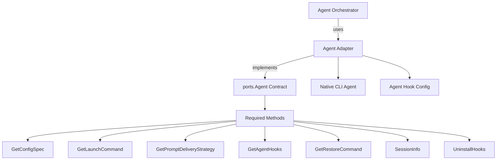
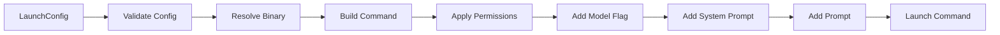
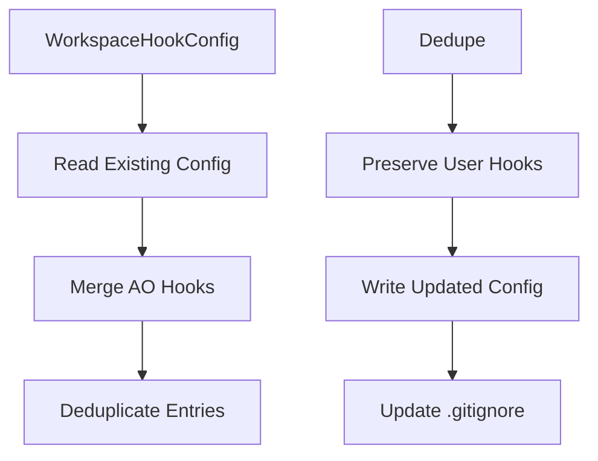
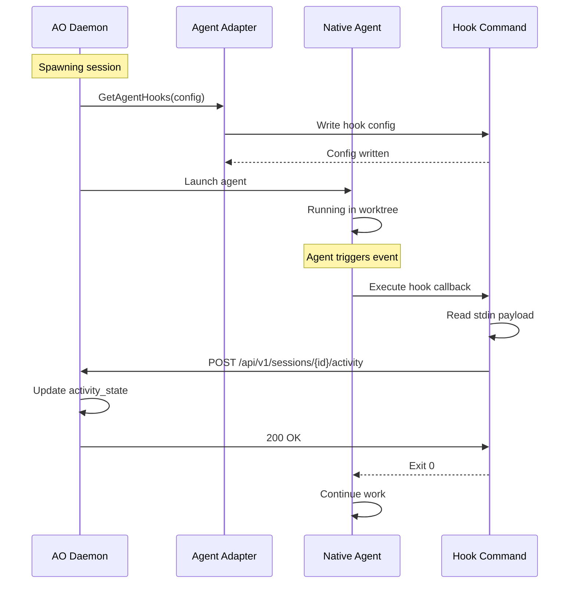
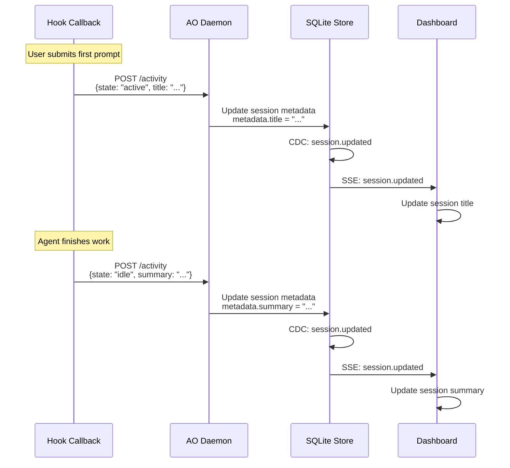
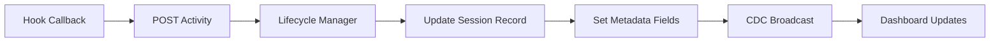
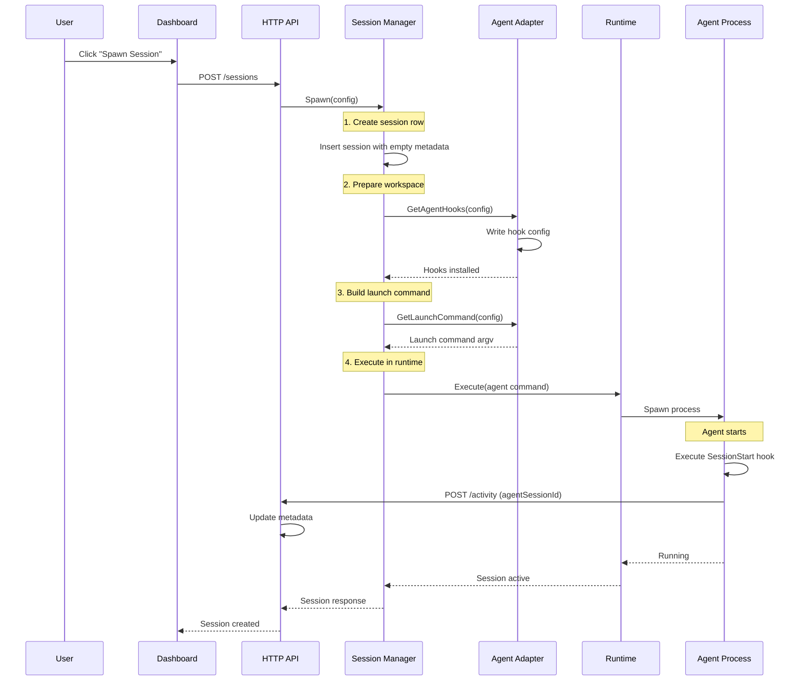
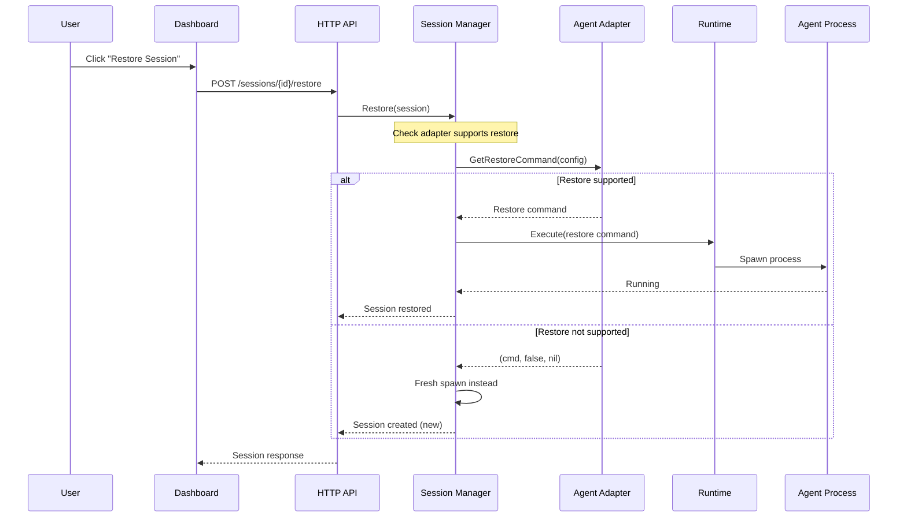
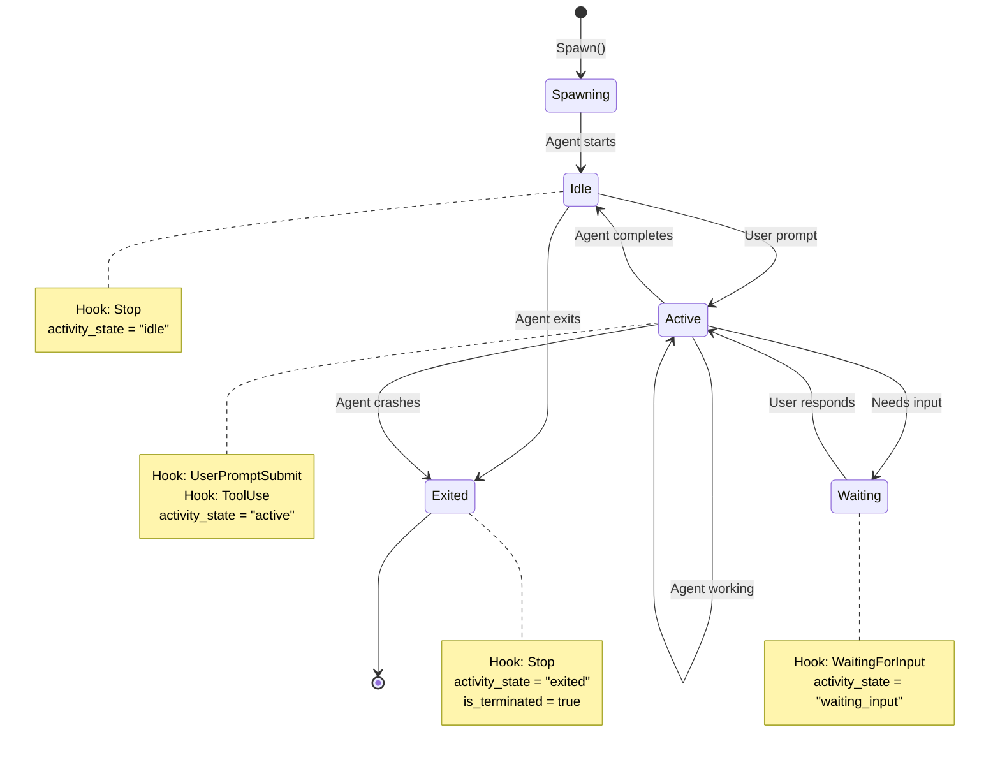
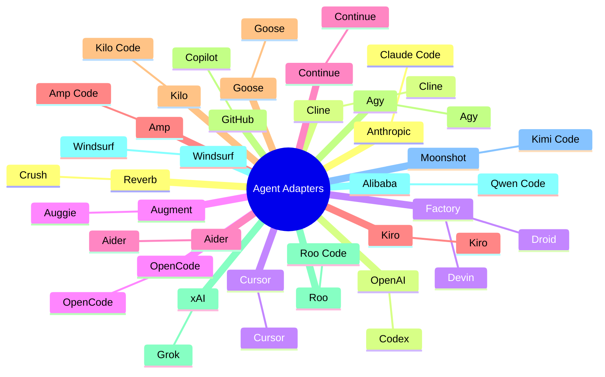

# Agent Adapter Contract

This document defines the contract between Agent Orchestrator and CLI-based coding agent adapters. Every agent must implement the contract defined in `backend/internal/ports/agent.go` to be usable by AO.

## Table of Contents

- [Overview](#overview)
- [Agent Contract](#agent-contract)
- [Hook System](#hook-system)
- [Session Metadata](#session-metadata)
- [Agent Lifecycle](#agent-lifecycle)
- [Implementation Guide](#implementation-guide)
- [Supported Agents](#supported-agents)
- [Testing](#testing)

---

## Overview

Agent adapters let AO run and observe different CLI coding agents without hardcoding agent-specific behavior into the spawn engine. The adapter contract provides:

- **Agent discovery** — Find and validate the agent binary
- **Launch configuration** — Build the native agent command
- **Session restoration** — Resume existing sessions
- **Hook integration** — Install and manage agent hooks
- **Metadata extraction** — Surface session title, summary, and native session ID



---

## Agent Contract

### Port Interface

The `ports.Agent` interface (defined in `backend/internal/ports/agent.go`) specifies the required adapter methods:

```go
// Agent is the interface all coding agent adapters must implement.
type Agent interface {
    // GetConfigSpec describes user-facing agent configuration.
    GetConfigSpec() ConfigSpec

    // GetLaunchCommand builds the native agent command for spawning a new session.
    GetLaunchCommand(ctx context.Context, cfg LaunchConfig) ([]string, error)

    // GetPromptDeliveryStrategy reports how the prompt is delivered.
    GetPromptDeliveryStrategy() PromptDeliveryStrategy

    // GetAgentHooks installs or merges AO hooks into the agent's workspace-local config.
    GetAgentHooks(ctx context.Context, cfg WorkspaceHookConfig) error

    // GetRestoreCommand builds a command to resume an existing session.
    GetRestoreCommand(ctx context.Context, cfg RestoreConfig) ([]string, bool, error)

    // SessionInfo returns normalized session metadata from the session record.
    SessionInfo(ctx context.Context, session SessionRef) (SessionInfo, bool, error)

    // UninstallHooks removes AO hooks from the workspace.
    UninstallHooks(ctx context.Context, workspacePath string) error
}
```

### Method Details

#### GetConfigSpec()

Returns a specification of user-facing configuration options:

```go
type ConfigSpec struct {
    // Permissions is the permission mode the agent supports.
    Permissions PermissionMode

    // Model is the optional model identifier (e.g., "claude-3-5-sonnet-20241022").
    Model string

    // SupportsSystemPrompt indicates the agent accepts a system prompt.
    SupportsSystemPrompt bool

    // SupportsRestore indicates the agent supports session restoration.
    SupportsRestore bool
}
```

#### GetLaunchCommand()

Builds the native agent launch command:



**Input (`LaunchConfig`):**

- `SessionID` — AO session identifier
- `ProjectID` — AO project identifier
- `Prompt` — User prompt to send
- `Config` — Agent-specific configuration
- `Permissions` — Permission mode override
- `WorkspacePath` — Path to session worktree

**Output:** Executable command line as argv array

#### GetPromptDeliveryStrategy()

Reports how the prompt is delivered to the agent:

```go
type PromptDeliveryStrategy string

const (
    // StrategyArgv means the prompt is passed as a command-line argument.
    StrategyArgv PromptDeliveryStrategy = "argv"

    // StrategyStdin means the prompt is written to stdin after launch.
    StrategyStdin PromptDeliveryStrategy = "stdin"
)
```

#### GetAgentHooks()

Installs AO hooks into the agent's workspace-local configuration:



**Requirements:**

- Preserve all user hooks
- Deduplicate AO hook entries
- Make AO hooks machine-portable (use `ao hooks ...` command)
- Ensure all written files are covered by `.gitignore`

#### GetRestoreCommand()

Builds a command to resume an existing session:

**Input (`RestoreConfig`):**

- `Session` — Complete session record with metadata
- `Permissions` — Permission mode to apply
- `SystemPrompt` — System prompt to re-apply

**Output:**

- `cmd` — Restore command argv
- `ok` — True if restore is supported
- `err` — Error if restore fails

#### SessionInfo()

Returns normalized session metadata from the stored session record:

```go
type SessionInfo struct {
    // AgentSessionID is the native agent's session identifier.
    AgentSessionID string

    // Title is the display title derived from the first user prompt.
    Title string

    // Summary is the display summary derived from the final assistant message.
    Summary string

    // Metadata contains adapter-specific extra fields.
    Metadata map[string]any
}
```

**Important:** `SessionInfo` must read from the `session.Metadata` map (populated by hooks), not from scanning agent transcript/cache files.

#### UninstallHooks()

Removes AO hooks from the workspace while preserving user hooks.

---

## Hook System

### Hook Overview

AO uses agent hooks to receive activity signals and session metadata from running agents:



### Hook Events

AO supports hooks for these agent events:

| Event              | Purpose               | Activity State     |
| ------------------ | --------------------- | ------------------ |
| `SessionStart`     | Session initialized   | -                  |
| `UserPromptSubmit` | User submitted prompt | `active`           |
| `AssistantMessage` | Assistant response    | -                  |
| `ToolUse`          | Agent used a tool     | `active`           |
| `Stop`             | Session stopped       | `idle` or `exited` |

### Hook Contract

All hook callbacks follow this contract:

```bash
# Hook command format
ao hooks <agent-adapter> <event> <session-id>

# Input (stdin)
# JSON payload from agent (agent-specific format)

# Output (stdout)
# None (discarded)

# Exit code
# 0 = success (always, even on delivery failure)
```

### Hook Behavior

```mermaid
flowchart TD
    Trigger[Agent Event Triggered] --> Execute[Execute Hook Command]
    Execute --> ReadEnv[Read AO_SESSION_ID<br/>from environment]
    ReadEnv --> CheckSession{Is AO Session?}
    CheckSession -->|No| Exit[Exit 0 - ignore]
    CheckSession -->|Yes| ReadStdin[Read JSON Payload<br/>from stdin]
    ReadStdin --> Derive[Derive Activity State<br/>from event]
    Derive --> Post[POST to Daemon<br/>/api/v1/sessions/{id}/activity]
    Post --> Success{Success?}
    Success -->|Yes| Update[Daemon updates<br/>activity_state]
    Success -->|No| Log[Log to hooks.log<br/>under AO_DATA_DIR]
    Update --> Exit
    Log --> Exit

```

**Critical rules:**

1. **Always exit 0** — Hook failure must never break the user's agent
2. **Log failures** — Append to `hooks.log` under `AO_DATA_DIR`
3. **Best-effort delivery** — The daemon may be temporarily unavailable
4. **Idempotent** — Duplicate hook deliveries are safe

### Hook Installation Patterns

Different agents use different hook mechanisms:

#### Claude Code / Compatible Agents

```json
// .claude/hooks.json
{
	"SessionStart": ["ao hooks claude-code SessionStart"],
	"UserPromptSubmit": ["ao hooks claude-code UserPromptSubmit"],
	"Stop": ["ao hooks claude-code Stop"]
}
```

#### Factory Droid

```json
// .factory/hooks.json
{
	"hooks": [
		{
			"event": "agent:beforeThinking",
			"command": "ao hooks droid beforeThinking"
		},
		{
			"event": "agent:afterThinking",
			"command": "ao hooks droid afterThinking"
		}
	]
}
```

#### Codex (Session Flags)

```bash
# Codex passes hooks as session flags
codex -c 'hooks.SessionStart=["ao hooks codex SessionStart"]' \
       -c 'hooks.Stop=["ao hooks codex Stop"]' \
       --dangerously-bypass-hook-trust
```

---

## Session Metadata

### Metadata Keys

Hook callbacks persist normalized keys in the session metadata JSON blob:

```go
const (
    // MetadataKeyAgentSessionID is the native agent's session identifier.
    MetadataKeyAgentSessionID = "agentSessionId"

    // MetadataKeyTitle is the display title from the first user prompt.
    MetadataKeyTitle = "title"

    // MetadataKeySummary is the display summary from the final assistant message.
    MetadataKeySummary = "summary"
)
```

### Metadata Flow



### Metadata Persistence



---

## Agent Lifecycle

### Spawn Flow



### Restore Flow



### Activity Flow



---

## Implementation Guide

### Adapter Template

```go
package myagent

import (
    "context"
    "fmt"
)

// Plugin is the MyAgent adapter.
type Plugin struct {
    // Adapter state (e.g., resolved binary path)
}

// New returns a ready-to-register MyAgent adapter.
func New() *Plugin {
    return &Plugin{}
}

// GetConfigSpec describes the agent configuration.
func (p *Plugin) GetConfigSpec() ports.ConfigSpec {
    return ports.ConfigSpec{
        Permissions:        ports.PermissionReadWrite,  // or ReadOnly, WriteOnly
        SupportsSystemPrompt: true,
        SupportsRestore:     true,
    }
}

// GetLaunchCommand builds the native agent command.
func (p *Plugin) GetLaunchCommand(ctx context.Context, cfg ports.LaunchConfig) ([]string, error) {
    // 1. Validate config
    if err := cfg.Config.Validate(); err != nil {
        return nil, fmt.Errorf("myagent: %w", err)
    }

    // 2. Resolve binary
    binary, err := p.resolveBinary(ctx)
    if err != nil {
        return nil, err
    }

    // 3. Build command
    cmd := []string{binary}

    // Add flags (model, permissions, etc.)
    if cfg.Config.Model != "" {
        cmd = append(cmd, "--model", cfg.Config.Model)
    }

    // Add system prompt if supported
    if cfg.SystemPrompt != "" {
        cmd = append(cmd, "--system-prompt", cfg.SystemPrompt)
    }

    // Add prompt
    if cfg.Prompt != "" {
        cmd = append(cmd, "--prompt", cfg.Prompt)
    }

    return cmd, nil
}

// GetPromptDeliveryStrategy reports how the prompt is delivered.
func (p *Plugin) GetPromptDeliveryStrategy() ports.PromptDeliveryStrategy {
    return ports.StrategyArgv  // or StrategyStdin
}

// GetAgentHooks installs AO hooks.
func (p *Plugin) GetAgentHooks(ctx context.Context, cfg ports.WorkspaceHookConfig) error {
    // 1. Read existing config
    config, err := p.readConfig(cfg.WorkspacePath)
    if err != nil {
        return err
    }

    // 2. Add AO hooks (preserving user hooks)
    config = p.addHooks(config, cfg.SessionID)

    // 3. Write updated config
    if err := p.writeConfig(cfg.WorkspacePath, config); err != nil {
        return err
    }

    // 4. Ensure .gitignore coverage
    if err := p.ensureGitignore(cfg.WorkspacePath); err != nil {
        return err
    }

    return nil
}

// GetRestoreCommand builds a restore command.
func (p *Plugin) GetRestoreCommand(ctx context.Context, cfg ports.RestoreConfig) ([]string, bool, error) {
    // 1. Extract native session ID from metadata
    sessionID := cfg.Session.Metadata[ports.MetadataKeyAgentSessionID]
    if sessionID == "" {
        return nil, false, nil  // Restore not supported
    }

    // 2. Build restore command
    binary, err := p.resolveBinary(ctx)
    if err != nil {
        return nil, false, err
    }

    cmd := []string{
        binary,
        "--resume", sessionID,
        // Re-apply permissions and system prompt
    }

    return cmd, true, nil
}

// SessionInfo returns normalized metadata.
func (p *Plugin) SessionInfo(ctx context.Context, session ports.SessionRef) (ports.SessionInfo, bool, error) {
    info := ports.SessionInfo{
        AgentSessionID: session.Metadata[ports.MetadataKeyAgentSessionID],
        Title:          session.Metadata[ports.MetadataKeyTitle],
        Summary:        session.Metadata[ports.MetadataKeySummary],
    }

    // Return hasData=true if any field is populated
    hasData := info.AgentSessionID != "" || info.Title != "" || info.Summary != ""

    return info, hasData, nil
}

// UninstallHooks removes AO hooks.
func (p *Plugin) UninstallHooks(ctx context.Context, workspacePath string) error {
    // Remove AO hook entries while preserving user hooks
    config, err := p.readConfig(workspacePath)
    if err != nil {
        return err
    }

    config = p.removeHooks(config)

    return p.writeConfig(workspacePath, config)
}
```

### Hook Implementation

```go
// Add hooks to the agent's config
func (p *Plugin) addHooks(config map[string]any, sessionID string) map[string]any {
    // Define AO hook commands
    aoHooks := map[string]string{
        "SessionStart":      "ao hooks myagent SessionStart",
        "UserPromptSubmit":  "ao hooks myagent UserPromptSubmit",
        "Stop":              "ao hooks myagent Stop",
    }

    // Merge with existing config, preserving user hooks
    for event, command := range aoHooks {
        if config[event] == nil {
            config[event] = []string{command}
        } else {
            // Deduplicate: check if AO hook already exists
            hooks := config[event].([]string)
            found := false
            for _, h := range hooks {
                if strings.HasPrefix(h, "ao hooks myagent") {
                    found = true
                    break
                }
            }
            if !found {
                config[event] = append(hooks, command)
            }
        }
    }

    return config
}
```

### Gitignore Enforcement

```go
import "github.com/aoagents/agent-orchestrator/backend/internal/adapters/agent/hookutil"

func (p *Plugin) ensureGitignore(workspacePath string) error {
    // Every file the adapter writes must be gitignored
    filesToIgnore := []string{
        ".myagent/config.json",
        ".myagent/hooks.json",
    }

    return hookutil.EnsureWorkspaceGitignore(workspacePath, ".myagent/")
}
```

---

## Supported Agents

### Current Adapters

AO currently supports 23+ agent adapters:



### Adapter Locations

```
backend/internal/adapters/agent/
├── agy/
├── aider/
├── amp/
├── augie/
├── claudecode/
├── clone/
├── codex/
├── continue/
├── cursor/
├── devin/
├── droid/
├── grok/
├── goose/
├── kilo/
├── kimi/
├── kiro/
├── opencode/
├── qwen/
├── roo/
├── crush/
├── windsurf/
└── ...
```

### Adapter Capabilities

| Agent       | Permissions | System Prompt | Restore | Hooks             |
| ----------- | ----------- | ------------- | ------- | ----------------- |
| Claude Code | ✓           | ✓             | ✓       | ✓                 |
| Codex       | ✓           | ✓             | ✓       | ✓ (session flags) |
| Cursor      | ✓           | ✓             | ✗       | ✗                 |
| OpenCode    | ✓           | ✓             | ✗       | ✗                 |
| Aider       | ✓           | ✓             | ✓       | ✓                 |
| Amp         | ✓           | ✓             | ✓       | ✓                 |
| Grok        | ✓           | ✓             | ✓       | ✓ (Claude compat) |
| ...         | ...         | ...           | ...     | ...               |

---

## Testing

### Unit Tests

```go
func TestGetLaunchCommand(t *testing.T) {
    p := New()
    cfg := ports.LaunchConfig{
        SessionID: "test-session",
        Prompt:    "Write a function",
        Config: domain.AgentConfig{
            Model: "gpt-4",
        },
    }

    cmd, err := p.GetLaunchCommand(context.Background(), cfg)
    assert.NoError(t, err)
    assert.Contains(t, cmd, "myagent")
    assert.Contains(t, cmd, "--model", "gpt-4")
    assert.Contains(t, cmd, "Write a function")
}
```

### Integration Tests

```go
func TestAgentE2E(t *testing.T) {
    // Skip if agent not installed
    if !agentInstalled(t) {
        t.Skip("myagent not installed")
    }

    // Create test project
    ctx := context.Background()
    project := createTestProject(t)

    // Spawn session
    session := spawnSession(t, ctx, project.ID, "myagent", "Hello")

    // Wait for activity
    waitForActivity(t, ctx, session.ID, "active")

    // Verify metadata
    info := getSessionInfo(t, ctx, session.ID)
    assert.NotEmpty(t, info.AgentSessionID)
    assert.NotEmpty(t, info.Title)

    // Kill session
    killSession(t, ctx, session.ID)
}
```

### Conformance Tests

```go
// TestGetAgentHooksFootprintIsGitignored verifies all adapter-written
// files are covered by .gitignore.
func TestGetAgentHooksFootprintIsGitignored(t *testing.T) {
    registry := agentRegistry.New()
    for _, adapter := range registry.List() {
        t.Run(adapter, func(t *testing.T) {
            tmpDir := t.TempDir()
            cfg := ports.WorkspaceHookConfig{
                WorkspacePath: tmpDir,
                SessionID:    "test-session",
            }

            agent := registry.Get(adapter)
            err := agent.GetAgentHooks(context.Background(), cfg)
            assert.NoError(t, err)

            // Verify all written files are gitignored
            verifyGitignore(t, tmpDir)
        })
    }
}
```

### Hook Tests

```go
func TestHookDelivery(t *testing.T) {
    // Mock daemon endpoint
    server := mockActivityServer(t)
    defer server.Close()

    // Simulate hook callback
    payload := map[string]any{
        "state": "active",
        "title": "Test session",
    }

    cmd := exec.Command("ao", "hooks", "myagent", "UserPromptSubmit", "test-session")
    cmd.Env = append(cmd.Env,
        fmt.Sprintf("AO_SESSION_ID=%s", "test-session"),
        fmt.Sprintf("AO_DAEMON_URL=%s", server.URL),
    )

    stdin, _ := cmd.StdinPipe()
    json.NewEncoder(stdin).Encode(payload)
    stdin.Close()

    err := cmd.Run()
    assert.NoError(t, err)

    // Verify daemon received the activity
    assert.ActivityReceived(t, server, "active")
}
```

---

## Summary

**Key points:**

1. **Port contract** — All agents implement `ports.Agent`
2. **Hooks are critical** — Activity signals and metadata flow through hooks
3. **Always gitignore** — Every adapter-written file must be covered
4. **Metadata from hooks** — `SessionInfo` reads from metadata, not files
5. **Preserve user hooks** — Never delete user configuration
6. **Exit 0 always** — Hook failure must never break the agent

**Implementation checklist:**

- [ ] Implement `ports.Agent` interface
- [ ] Write hook installation/removal
- [ ] Ensure all files are gitignored
- [ ] Implement `SessionInfo` from metadata
- [ ] Add unit tests
- [ ] Add integration tests
- [ ] Add conformance tests
- [ ] Register in daemon wiring
